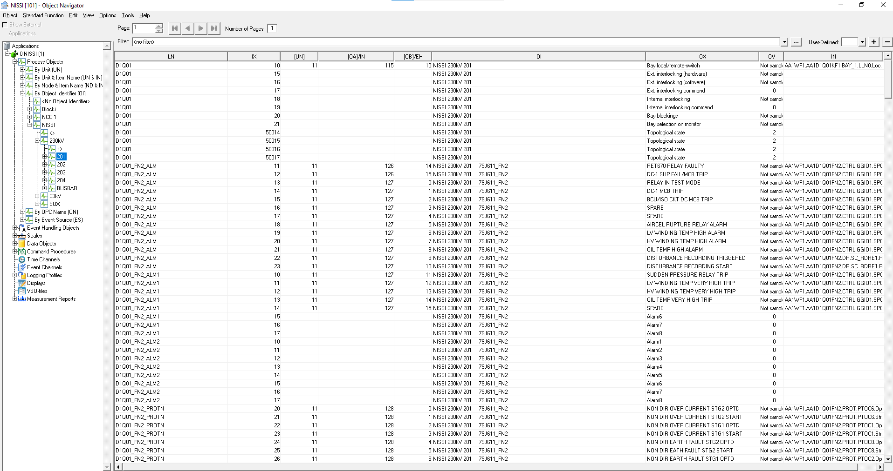
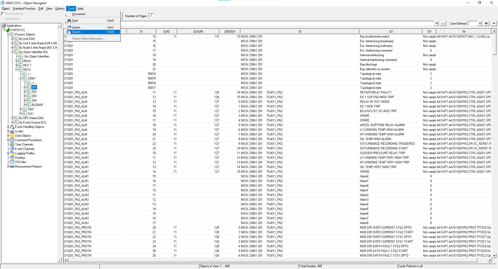
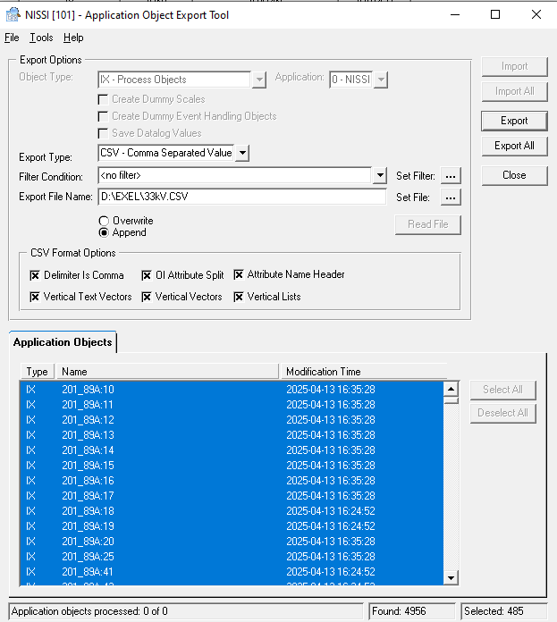
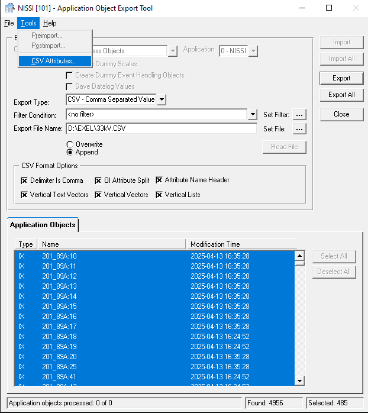
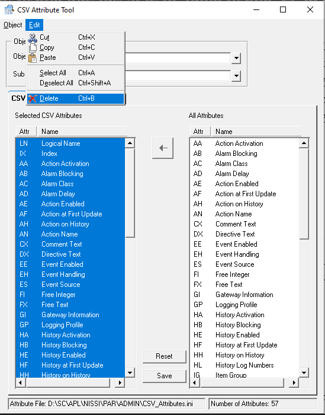
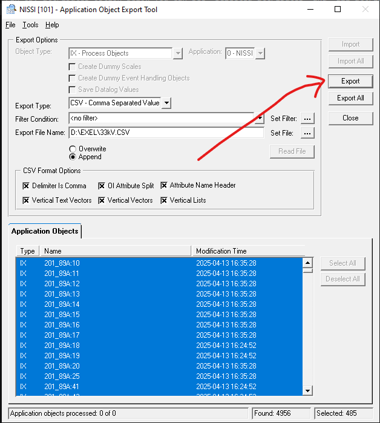

# MicroSCADA — Exporting Process Object File (CSV / SDB)

> Step-by-step guide for exporting signal data from the Object Navigator using the Application Object Export Tool.

---

## Step 1 — Select the Bay You Want to Export

- Open the **Object Navigator** (NISSI application)
- In the left panel, navigate to the bay you want to export
- Click on the bay to select it (e.g., **Bay 201**)

---

## Step 2 — Open Export via Tools Menu

- In the toolbar, click **Tools**
- From the dropdown, click **Export**

---

## Step 3 — Export Popup Opens (Application Object Export Tool)

The **Application Object Export Tool** popup will open.

Configure the following options inside the popup:

### Export Type
- Choose between **CSV** (Comma Separated Value) or **SDB**
- For Excel-friendly data → choose **CSV**

### Export File Location
- Set the path where you want the file to be saved
- Example: `D:\EXEL\33kV.CSV`
- Click **Set File** to browse and choose your location

### Append vs Overwrite
| Option | What it does |
|--------|-------------|
| **Append** | If you export a second file, the new data is added **below** the existing file data |
| **Overwrite** | If you export a second file, it **replaces** the existing file data |

### CSV Format Options
- Make sure **all options are enabled** in the CSV Format Options section:
  - ✅ Delimiter Is Comma
  - ✅ OI Attribute Split
  - ✅ Attribute Name Header
  - ✅ Vertical Text Vectors
  - ✅ Vertical Vectors
  - ✅ Vertical Lists

> ⚠️ Enabling all CSV format options ensures you get **clean, readable data** when you open the file in Excel.

---

## Step 4 — Configure CSV Attributes (Choose Which Headers to Export)

This step controls **which columns/headers** appear in your exported CSV file.

- In the Export Tool, go to **Tools** in the toolbar
- Click **CSV Attributes**

The **CSV Attribute Tool** will open.

### How to Use CSV Attributes

You will see two panels:
- **Selected CSV Attributes** (left) — headers that will be in your export
- **All Attributes** (right) — full list of available headers

### To Reset and Start Fresh (Remove All Selected Attributes):
1. Click **Edit** in the toolbar
2. Click **Select All** — selects everything in the Selected Attributes panel
3. Click **Edit** again
4. Click **Delete** — removes all selected attributes

### To Add Only the Attributes You Want:
- From the **All Attributes** panel on the right, select only what you need
- Example: if you only want a signal list → select **Item Name** and **Object Text** only
- Click **Save** when done
- Don't close the CSV Attribute tab.

---

## Step 5 — Export the File

Back in the main **Application Object Export Tool** window:

- To export only the **selected bay** → click **Export**
- To export the **entire project** → click **Export All**

> ⚠️ Make sure you have the correct bay selected before clicking Export — otherwise you may export the wrong data.

---

## Full Step Summary

| Step | Action |
|------|--------|
| 1 | Open Object Navigator → select the bay (e.g., Bay 201) |
| 2 | Toolbar → Tools → Export |
| 3 | Set Export Type (CSV or SDB), file location, Append/Overwrite |
| 4 | Enable all CSV Format Options |
| 5 | Tools → CSV Attributes → configure which headers you want |
| 6 | Click **Export** (selected bay) or **Export All** (full project) |

---

## Key Points to Remember

- Always **enable all CSV Format Options** for clean Excel-readable output
- Use **CSV Attributes** to control exactly which columns appear — useful for creating a clean signal list
- **Append** adds data below existing file — **Overwrite** replaces it — choose carefully
- **Export** = selected bay only | **Export All** = full project

---

*Last updated: April 2026 | MicroSCADA Object Navigator Export Guide*