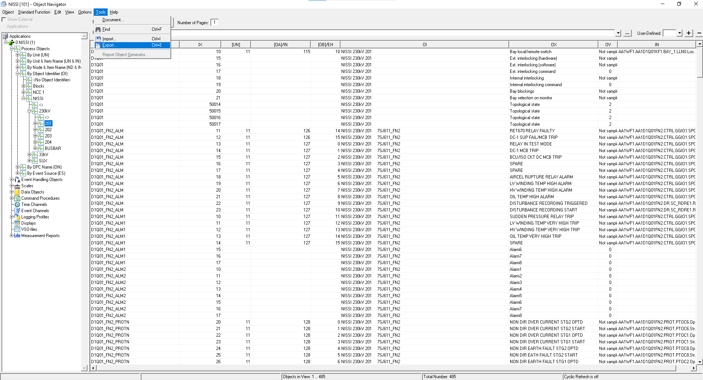
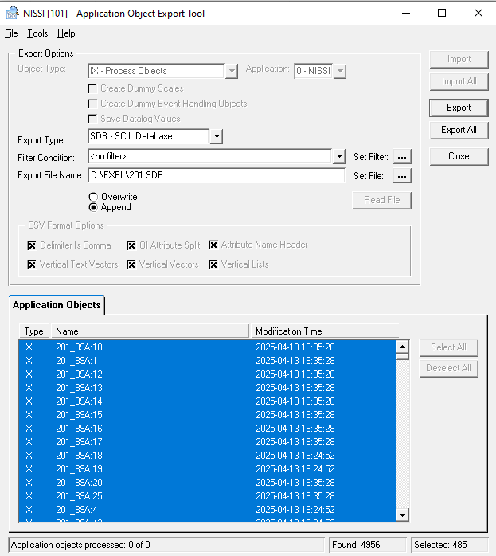
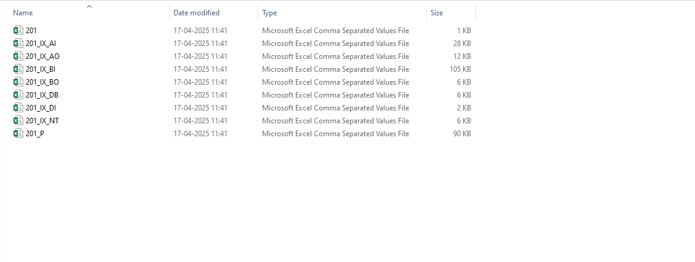
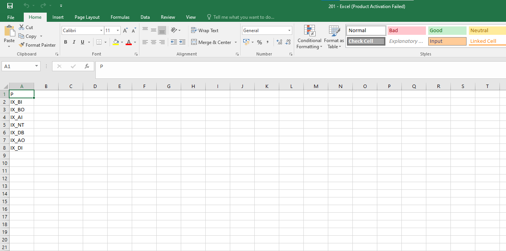
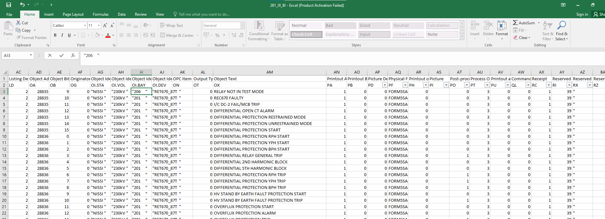
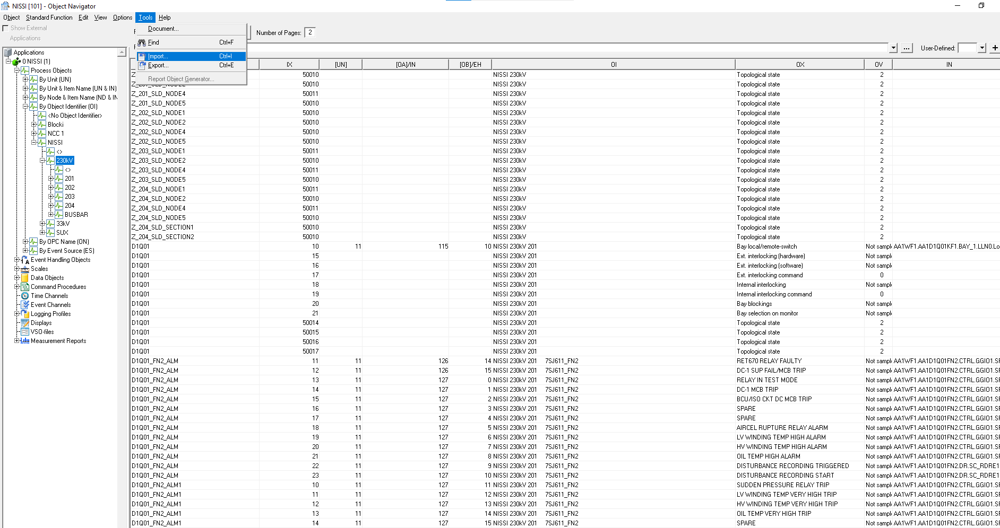
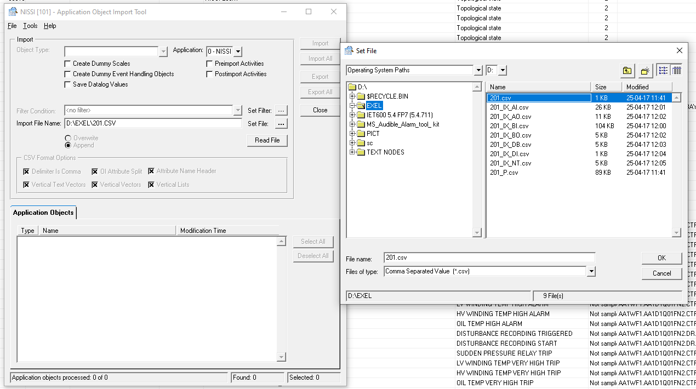
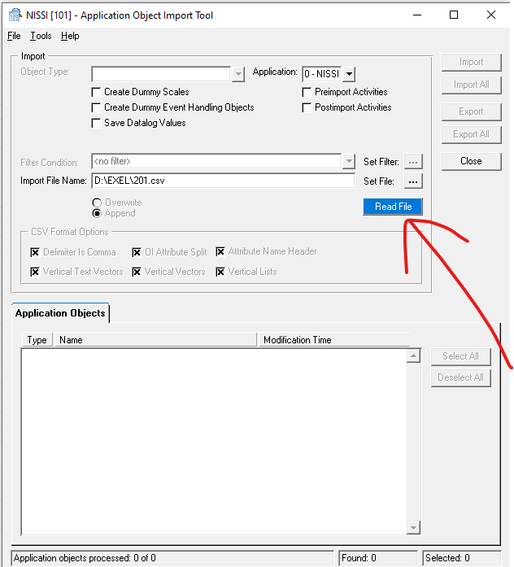
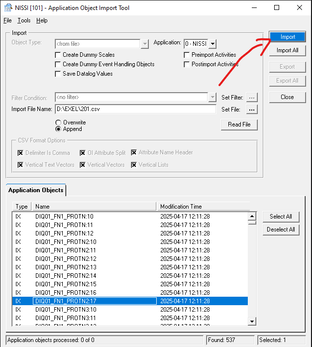
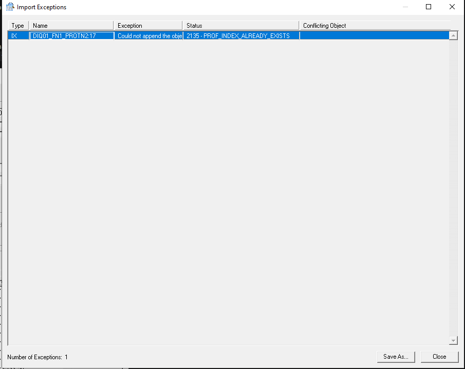

# MicroSCADA — Importing CSV / SDB into Process Object

> Step-by-step guide for importing a bay's CSV/SDB file into the Process Object.
> Covers two import methods: adding a new bay based on an existing one, and importing a full project into a new application.

---

## Two Types of Import

| Method | When to use |
|--------|-------------|
| **Method 1 — Single Bay Import** | You already have a bay (e.g., 201) and want to create a similar new bay (e.g., 206) by copying and modifying |
| **Method 2 — Full Project Import** | Importing a complete project into a new/blank application |

---

## Method 1 — Single Bay Import (Copy & Modify Existing Bay)

### Step 1 — Export the Existing Bay as CSV

- In the **Object Navigator**, select the bay you want to copy (e.g., **Bay 201**)
- Go to **Tools → Export**

- In the Export popup, set **Export Type = SDB** or **CSV** as needed
- Set the export file location
- Click **Export**

---

### Step 2 — Understand the Exported Files

After exporting, you will see **multiple CSV files** in the export folder — this is normal.

The files are automatically separated by signal type:

| File Name | Content |
|-----------|---------|
| `201` | **Main file** — lists all sub-files (this is the one you import) |
| `201_IX_BI` | Binary Input signals |
| `201_IX_BO` | Binary Output signals |
| `201_IX_AI` | Analog Input signals |
| `201_IX_AO` | Analog Output signals |
| `201_IX_DI` | Digital Input signals |
| `201_IX_DB` | Digital objects |
| `201_IX_NT` | Network Object State |
| `201_P` | Pulse Counter |

> ⚠️ When importing into Process Object, **only select the main file** (e.g., `201` or `201.csv`) — not the sub-files. The main file references all sub-files automatically.

---

### Step 3 — Open the Main CSV File

- Open the main file (e.g., `201.csv`) in Excel
- You will see a list of all sub-files referenced inside it

---

### Step 4 — Make Changes in Excel

- Open the relevant sub-file (e.g., `201_IX_BI.csv`) to edit signal details
- Change the **bay name**, **IED name**, **IDs**, and any other parameters to match the new bay (e.g., Bay 202)

> ⚠️ **Critical — How to Save the Excel File:**
> - Do **NOT** click the **Save button** in the top left corner of Excel
> - Instead, **close the Excel file** — it will automatically ask you to save
> - Click **Yes** to save
>
> **Reason:** Using the Save button in the left corner **collapses/corrupts the Excel data format**, which will cause import errors.

---

### Step 5 — Open Import Tool

- In the **Object Navigator**, select the target level (e.g., **230kV**)
- Go to **Tools → Import**

- The **Application Object Import Tool** popup will open

---

### Step 6 — Select the File to Import

- In the Import popup, click **Set File**
- Browse to your edited CSV file and select it (e.g., `201.csv`)
- Click **OK**

---

### Step 7 — Click Read File

- After selecting the file, click the **Read File** button

> ⚠️ **This step is commonly forgotten** — always click **Read File** after selecting the file. Without this, the application objects list will stay empty.

- Once Read File is clicked, the Application Objects list will populate with all signals from the file

---

### Step 8 — Click Import

- After the objects appear in the list, click the **Import** button to import them into the Process Object

---

### Error — "Could Not Append" / PROF_INDEX_ALREADY_EXISTS

If you see this error during import:

| Error | Cause | Fix |
|-------|-------|-----|
| `Could not append the object` | The IED name or ID in the CSV file **already exists** in the Process Object — you forgot to change it | Open the Excel file → find and delete or rename the duplicate IED name/ID → save → click Read File again |

> ⚠️ **Before importing, always verify:**
> - No duplicate **IED names** in the edited Excel file
> - No duplicate **IDs** in the edited Excel file
> - All bay names and parameters are updated to the new bay values

---

### Step 9 — Re-read and Re-import After Fix

- After fixing the duplicate in Excel
- Go back to the Import popup
- Click **Read File** again
- Then click **Import**

---

## Method 2 — Full Project Import**  Importing a complete project into a new/blank application

- Just like method-1 -> you Have to export whole project(NISSI<->230KV & 33KV <-> 201,202..&301,302...)- IF you want to make changes(LIKECHANGE *NISSI* to *NISSI LAB*), do it in exel ->then create new application -> process object -> select object identifier -> import csv file.

## Key Rules to Remember

- **Only import the main file** (`201.csv`) — not the sub-files
- **Never use the Save button in Excel** — always close the file and save via the auto-prompt
- **Always click Read File** after selecting the file in the Import popup — this step is easy to forget
- **No duplicate IED names or IDs** — duplicates will throw the `PROF_INDEX_ALREADY_EXISTS` error
- If the error appears → fix in Excel → Read File again → Import again

---

## Full Step Summary

| Step | Action |
|------|--------|
| 1 | Select existing bay in Object Navigator → Tools → Export |
| 2 | Export as CSV → multiple files will be created (normal) |
| 3 | Open main CSV file (`201.csv`) — it lists all sub-files |
| 4 | Edit signal parameters in Excel (rename IED, bay, IDs for new bay) |
| 5 | **Close** Excel to save — do NOT use the Save button |
| 6 | In Object Navigator, select target level → Tools → Import |
| 7 | Click Set File → browse and select edited CSV |
| 8 | Click **Read File** — objects will appear in the list |
| 9 | Click **Import** |
| 10 | If error appears → fix duplicate in Excel → Read File → Import again |

---

*Last updated: April 2026 | MicroSCADA Process Object Import Guide*