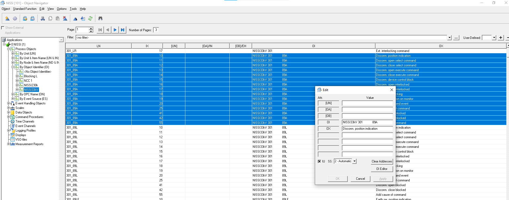
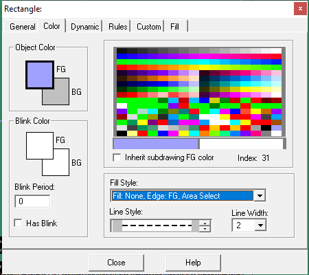

# Things i learned during microscada task

## CASE:1

1. when you export from one project and import to another project, it won't show correctly at the object identifie at the process object --> one of the of the solution is --> click object identifier it will show all objects(dont forgot to select (view->process object by table)) -> then select particular no of devices like 89A -> right click edit -> there OI EDITOR OPTION "CLICK IT" -> Change the object identification there.

## CASE:2

 - How to Set Select button of single bay at OVERALL SLD PAGE.
 - first chose box section which is located at the left side of *display builder*.
 - draw rectangle box over single bay sld 
 - select the properties of that box - chose settings which is in the following image

 

 