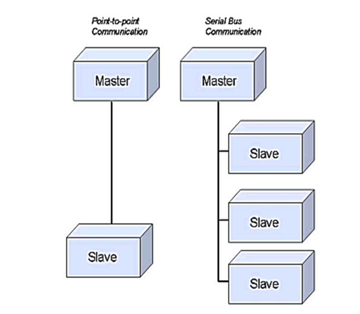

- The Modbus Communications Protocol is an asynchronous, byte packaged protocol used for
communications between the master stations and Intelligent Electronic Devices (IEDs) or Remote
Terminal Units (RTUs)

-  The Modbus
protocol functions as a true serial line or Transmission Control Protocol (TCP) network

-  The Modbus
protocol functions as a true serial line or Transmission Control Protocol (TCP) network

-  PC-NET is the protocol master. The communication with external devices is done by using the
Modbus RTU protocol mode

- The current version of the Modbus implementation in the PC_NET supports functions 1, 2, 3, 4, 5, 6,
15, 16.

-  The overall performance of Modbus/TCP is higher compared to serial line
Modbus due to the faster transmission speed.

- Examples
#SET NET'NET':SSD'LINE' = "COM5 ";line uses serial port 5
#SET NET'NET':SSD'LINE' = "TCP ";line uses TCP connection

- SYS600 is able to keep several connections open to the controlled stations at the same time. Multiple
Modbus/TCP lines may be created in the same computer.

- Using line attribute OM bit 1,

- The implementation of the Modbus master protocol in SYS600 can be divided into two layers: link layer
and application layer. Both of these layers have a specific functionality and a set of attributes of their
own. The link layer corresponds to a line of a NET unit and the application layer corresponds to a station
configured to the line

- The implementation of the Modbus master protocol in SYS600 supports direct and serial bus topologies.
The direct topology (point-to-point) can be a direct physical cable from point-to-point or a two-node radio,
or modem network. The serial bus topology (multi-drop) is commonly made up of many modems with
their outputs and inputs either tied together or linked using a star-coupler. 

- 

## advanced system configuration settings:

1. LAST indication where it will show on the address of modbus -->base address(address where we write on the modsim) + (laast object address - first object address)*16(each registers how many bits) + bitcount --> 100 + (1)*16 +16 = **132**

2. what i want to do is :
- first binary indication check
- secondly anolog value

3. create a python code for finding a modbus base address
4. create a python code for creating a exel sheet for bloc address and object bit address genration if you put parameters(first object , last object, bitcount, base address) - it has to be creat like sheet of block address and bit address where we can find the data in modbus address.

### binary indication

1. single indication check
- at modsim i am going to give the value of binary input from 1 to 16 (**input status - FC-02**)
- So first object adress is --> 1 & second object address is --> 1
- bit count --> 16 
- So first object adress is --> 1 & second object address is --> 2
- bit count --> 0
- block address - 1 for evrything
- object bit address is - 1 to 16.

2. double indication check - DONT KNOW HOW TO CHECK - ASK ESWAR
3. both function codes - read coil & discrete input - IS THERE WAY TO WRITE COMMAND FROM HMI - ASK ESWAR
4. DOES BLOCK ADDRESS CAN BE SAME IN THE PROCESS OBJECT FOR DIFFERENT MFM ONE WITH TCP AND ONE WITH SERIAL - ASK ESWAR

### measurement - analog value 

1. analog value
2. different types of data type