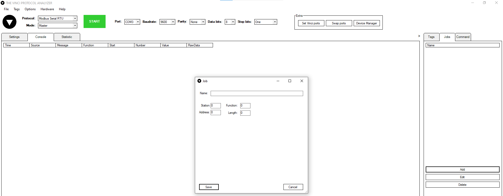

# Modbus Protocol — Complete Reference Documentation

---

## Table of Contents

1. [Function Code Reference](#1-function-code-reference)
   - 1.1 [Bit Access (Coils & Discrete Inputs)](#11-bit-access-coils--discrete-inputs)
   - 1.2 [16-Bit Register Access (Holding & Input Registers)](#12-16-bit-register-access-holding--input-registers)
   - 1.3 [Diagnostics & Special Function Codes](#13-diagnostics--special-function-codes)
   - 1.4 [Most Commonly Used Function Codes](#14-most-commonly-used-function-codes)
2. [Address System — Display vs Wire](#2-address-system--display-vs-wire)
   - 2.1 [The Off-By-One Rule](#21-the-off-by-one-rule)
   - 2.2 [Address Mapping Table](#22-address-mapping-table)
   - 2.3 [Real-World Example (ModSim vs Vinci)](#23-real-world-example-modsim-vs-vinci)
3. [Data Types & Register Sizes](#3-data-types--register-sizes)
   - 3.1 [Why Data Types Consume Multiple Registers](#31-why-data-types-consume-multiple-registers)
   - 3.2 [Data Type Reference Table](#32-data-type-reference-table)
   - 3.3 [Float Storage Example](#33-float-storage-example)
   - 3.4 [Practical Addressing Rules](#34-practical-addressing-rules)
   - 3.5 [Byte Order — Normal vs Swapped (Endianness)](#35-byte-order--normal-vs-swapped-endianness)
   - 3.6 [Entering Values in ModSim](#36-entering-values-in-modsim)
4. [Exception Codes — Error Handling](#4-exception-codes--error-handling)
   - 4.1 [What is an Exception Response?](#41-what-is-an-exception-response)
   - 4.2 [Exception Code Details](#42-exception-code-details)
   - 4.3 [Quick Cheat Sheet](#43-quick-cheat-sheet)
5. [Software Notes — ModScan & Vinci](#5-software-notes--modscan--vinci)
   - 5.1 [ModScan Tips](#51-modscan-tips)
   - 5.2 [Vinci Software Tips](#52-vinci-software-tips)

---

## 1. Function Code Reference

Function Codes (FC) tell the slave device **which register table to access** and **what action to perform** (read or write).

---

### 1.1 Bit Access (Coils & Discrete Inputs)

These function codes operate on **1-bit (ON/OFF)** data.

| FC (Dec) | FC (Hex) | Data Type | Action | Display Address | Wire Address | Access |
|---|---|---|---|---|---|---|
| 01 | 0x01 | Coil (1 bit) | Read Coils | 00001 – 09999 | 0x0000 – 0xFFFF | Read |
| 05 | 0x05 | Coil (1 bit) | Write Single Coil | 00001 – 09999 | 0x0000 – 0xFFFF | Write |
| 15 | 0x0F | Coil (1 bit) | Write Multiple Coils | 00001 – 09999 | 0x0000 – 0xFFFF | Write |
| 02 | 0x02 | Discrete Input (1 bit) | Read Discrete Inputs | 10001 – 19999 | 0x0000 – 0xFFFF | Read only |

---

### 1.2 16-Bit Register Access (Holding & Input Registers)

These function codes operate on **16-bit (0 – 65535)** register data.

| FC (Dec) | FC (Hex) | Data Type | Action | Display Address | Wire Address | Access |
|---|---|---|---|---|---|---|
| 03 | 0x03 | Holding Register (16 bit) | Read Holding Registers | 40001 – 49999 | 0x0000 – 0xFFFF | Read |
| 06 | 0x06 | Holding Register (16 bit) | Write Single Register | 40001 – 49999 | 0x0000 – 0xFFFF | Write |
| 16 | 0x10 | Holding Register (16 bit) | Write Multiple Registers | 40001 – 49999 | 0x0000 – 0xFFFF | Write |
| 23 | 0x17 | Holding Register (16 bit) | Read/Write Multiple Registers | 40001 – 49999 | 0x0000 – 0xFFFF | Read + Write |
| 04 | 0x04 | Input Register (16 bit) | Read Input Registers | 30001 – 39999 | 0x0000 – 0xFFFF | Read only |

> **Note on FC 23:** Reads and writes in a single packet — useful when you want to send a setpoint and receive a reading in one round trip.

---

### 1.3 Diagnostics & Special Function Codes

| FC (Dec) | FC (Hex) | Data Type | Action | Display Address | Wire Address | Access |
|---|---|---|---|---|---|---|
| 07 | 0x07 | — | Read Exception Status | — | — | Read only |
| 08 | 0x08 | — | Diagnostics (sub-codes 00–18) | — | — | Read + Write |
| 11 | 0x0B | — | Get Com Event Counter | — | — | Read only |
| 12 | 0x0C | — | Get Com Event Log | — | — | Read only |
| 17 | 0x11 | — | Report Server ID | — | — | Read only |
| 20 | 0x14 | File record | Read File Record | — | — | Read only |
| 21 | 0x15 | File record | Write File Record | — | — | Write |
| 22 | 0x16 | Holding Register | Mask Write Register | 40001 – 49999 | 0x0000 – 0xFFFF | Write |
| 24 | 0x18 | — | Read FIFO Queue | — | — | Read only |
| 43 | 0x2B | — | Read Device Identification (MEI) | — | — | Read only |

> **Note on FC 08:** Has 19 sub-codes covering loopback tests, counter resets, and various diagnostics.

---

### 1.4 Most Commonly Used Function Codes

In the field, these are the FCs you will encounter most often:

```
FC 01 — Read Coils                  - 00001 – 09999
FC 02 — Read Discrete Inputs        - 10001 – 19999
FC 03 — Read Holding Registers      - 40001 – 49999
FC 04 — Read Input Registers        - 30001 – 39999
```

---

## 2. Address System — Display vs Wire

### 2.1 The Off-By-One Rule

Modbus has two address representations:

- **Display address** — what you see in software like ModSim (human-readable, e.g. `40042`)
- **Wire address** — what actually travels on the RS-485 / TCP wire (zero-indexed, e.g. `41`)

The display prefix (`0`, `1`, `3`, `4`) **never goes on the wire**. The Function Code tells the slave which table to look in.

```
Wire address = Display address − 40001   (for Holding Registers)
Wire address = Display address − 1       (general shorthand)
```

**Example:**
```
Display address  40001  →  Wire address  0x0000  (0)
Display address  40042  →  Wire address  0x0029  (41)
```

---

### 2.2 Address Mapping Table

| ModSim Display Address | Wire Address (Vinci / Raw) |
|---|---|
| 40001 | 0 |
| 40002 | 1 |
| 40018 | 17 |
| 40019 | 18 |
| 40042 | 41 |

---

### 2.3 Real-World Example (ModSim vs Vinci)

```
ModSim display  →  40042  (you put value 4444 here)
Vinci address   →  41     (shows 4444 here)

Why?
  40042 - 40001 = 41  ✓

Same for another value:
  ModSim 40019  →  Vinci address 18   (40019 - 40001 = 18)  ✓
  ModSim 40042  →  Vinci address 41   (40042 - 40001 = 41)  ✓
```

> **This is NOT a bug — it is normal!**
> ModSim shows the `4xxxx` human-readable format.
> Vinci shows the raw wire address — what actually goes on the RS-485 wire.
> Both are pointing to the **exact same register**, just displayed differently.

---

## 3. Data Types & Register Sizes

### 3.1 Why Data Types Consume Multiple Registers

Each Modbus register is only 16 bits wide:

```
16-bit register  = 2 bytes  = max value 65535

Float  needs  32 bits  = 4 bytes  = 2 registers
Long   needs  32 bits  = 4 bytes  = 2 registers
64-bit needs  64 bits  = 8 bytes  = 4 registers
```

So a single float value **occupies two consecutive registers**, not one.

---

### 3.2 Data Type Reference Table

| Display Option | Bits | Registers Used | Address Space Example |
|---|---|---|---|
| Binary | 16 | 1 register | 40001 only |
| Decimal | 16 | 1 register | 40001 only |
| Hex | 16 | 1 register | 40001 only |
| Long Integer | 32 | 2 registers | 40001 + 40002 |
| Long (Swapped) | 32 | 2 registers | 40001 + 40002 |
| Floating Point | 32 | 2 registers | 40001 + 40002 |
| Float (Swapped) | 32 | 2 registers | 40001 + 40002 |
| 64-Bit Float | 64 | 4 registers | 40001 – 40004 |
| 64-Bit Swapped | 64 | 4 registers | 40001 – 40004 |

---

### 3.3 Float Storage Example

```
If you store a Float at 40001:
  40001  →  High word (first 16 bits)
  40002  →  Low word  (last 16 bits)
  40003  →  Next value starts HERE

NOT like this ❌:
  40001  →  Float value 1
  40002  →  Float value 2   ← WRONG! 40002 is still occupied by value 1!
```

**ModSim screenshot example:**
```
40014: <00546>
40015: <00798>   ← these two together = one Float value
40016: <00000>

40026: <00546>
40027: <06789>   ← these two together = another Float value
40028: <00000>
```

---

### 3.4 Practical Addressing Rules

```
Decimal / Hex / Binary  →  every address is independent
                            40001, 40002, 40003 ... each has its own value

Float / Long            →  skip every 2 addresses
                            40001 (value 1), 40003 (value 2), 40005 (value 3)

64-bit                  →  skip every 4 addresses
                            40001 (value 1), 40005 (value 2), 40009 (value 3)
```

---

### 3.5 Byte Order — Normal vs Swapped (Endianness)

Some devices store the two words of a 32-bit value in different orders — this is known as **Big Endian vs Little Endian**.

```
Normal Float:   [ High Word ][ Low Word ]
                   40001        40002

Swapped Float:  [ Low Word  ][ High Word ]
                   40001        40002
```

> **If your float value looks like garbage or a meaningless number — try the Swapped version!** The data is there, it is just stored in the opposite byte order.

---

### 3.6 Entering Values in ModSim

```
1. Select Display → Floating Point
2. Double-click 40001 → enter your float value
3. ModSim automatically splits it across 40001 and 40002

Your next float value → put at 40003 (NOT at 40002!)
```

---

## 4. Exception Codes — Error Handling

### 4.1 What is an Exception Response?

In normal Modbus communication:
- **Normal response:** Master asks → Slave replies with DATA

In error conditions:
- **Exception response:** Master asks → Slave replies with an ERROR code

**How to identify an exception response:**
The slave sends back the Function Code **plus 0x80**.

```
You sent FC 03 (0x03)
Error back: FC 0x83  (0x03 + 0x80 = 0x83)  ← error flag!
```

---

### 4.2 Exception Code Details

---

#### Exception Code 01 — ILLEGAL FUNCTION

**Meaning: "I don't know this command!"**

The slave does not support the requested Function Code.

```
Real-world analogy:
  You ask a basic calculator → "what is sin(x)?"
  Calculator says → "I don't have that function!"

Modbus example:
  Master sends FC 08 (Diagnostics)
  Slave is a simple cheap sensor
  Slave replies → Exception 01
  "I don't support FC 08, I only know FC 03 and 04!"
```

---

#### Exception Code 02 — ILLEGAL DATA ADDRESS

**Meaning: "That address doesn't exist in me!"**

The requested address or address range is outside what the slave supports.

```
Real-world analogy:
  Building has floors 1 to 10
  You press button 15 in the elevator
  Elevator says → "Floor 15 doesn't exist!"

Modbus example:
  Slave has registers from 0 to 99 (100 registers)
  Master asks: "Give me 5 registers starting at address 96"
  That means → 96, 97, 98, 99, 100
  But address 100 doesn't exist! → Exception 02 ❌

  If master asked 4 registers from 96 → 96, 97, 98, 99 ✅ works fine!
```

---

#### Exception Code 03 — ILLEGAL DATA VALUE

**Meaning: "The number you sent makes no sense at the protocol level!"**

The quantity or value in the request exceeds the protocol-defined limits.

```
Real-world analogy:
  A form asks for your age
  You type "abc" or "-500"
  Form says → "Invalid value!"

Modbus example:
  FC 01 Read Coils → max quantity allowed = 2000
  Master sends quantity = 5000
  Slave replies → Exception 03
  "I can't read 5000 coils at once, max is 2000!"
```

> ⚠️ **Important:** Exception 03 does NOT mean the application value is wrong. Modbus doesn't care if you write `9999` to a temperature register — it only checks protocol-level limits.

---

#### Exception Code 04 — SERVER DEVICE FAILURE

**Meaning: "I understood you, but something broke inside me!"**

The slave understood the request but an internal hardware/software failure prevented execution.

```
Real-world analogy:
  ATM understands your request
  But the cash mechanism is jammed
  ATM says → "Unable to process, internal error"

Modbus example:
  Master asks to read temperature sensor register
  Slave's internal ADC hardware failed
  Slave replies → Exception 04
  "I got your request but my hardware failed to read!"
```

---

#### Exception Code 05 — ACKNOWLEDGE

**Meaning: "I got your request, but give me time — I'll get back to you!"**

The slave accepted the request but it will take a long time to process. This is not an error — it is a progress notification.

```
Real-world analogy:
  You order food at a restaurant
  Waiter says → "Order received! It will take 30 minutes"
  Waiter didn't bring food yet — just confirmed receipt!

Modbus example:
  Master sends a firmware update command
  Slave says → Exception 05
  "I accepted it! But it takes a long time to process.
   Poll me later to check if I'm done!"
```

> The master should then send a **"Poll Program Complete"** message to check if the slave has finished processing.

---

#### Exception Code 06 — SERVER DEVICE BUSY

**Meaning: "I'm busy right now, try again later!"**

The slave is currently processing a long-running task and cannot accept a new request.

```
Real-world analogy:
  You call customer care
  "All our agents are busy, please call again later"

Modbus example:
  Slave is running a long calibration routine
  Master sends a new request during that time
  Slave replies → Exception 06
  "I'm busy! Retransmit your message when I'm free!"
```

---

#### Exception Code 08 — MEMORY PARITY ERROR

**Meaning: "I tried to read my own memory but it's corrupted!"**

An error was detected in the slave's memory when it attempted to read data.

```
Real-world analogy:
  You try to open a file on your PC
  Windows says → "File is corrupted, cannot read!"

Modbus example:
  Master asks to Read File Record (FC 20)
  Slave tries to read from its internal file storage
  Finds memory corruption
  Slave replies → Exception 08
  "My memory has a parity error, data is corrupted!"
```

---

#### Exception Code 0A — GATEWAY PATH UNAVAILABLE

**Meaning: "The gateway can't find a route to the slave!"**

Used in gateway environments (e.g. Modbus TCP to RTU). The gateway cannot internally route the message.

```
Real-world analogy:
  You send a package via courier
  Courier says → "We have no route to that location,
                  our internal routing is broken!"

Modbus example:
  You use a Modbus TCP → RTU gateway
  Gateway can't connect its input to output port
  Gateway is misconfigured or overloaded
  Returns → Exception 0A
```

---

#### Exception Code 0B — GATEWAY TARGET DEVICE FAILED TO RESPOND

**Meaning: "Gateway found the route but the slave is not responding!"**

The gateway successfully routed the request but the target slave device did not reply.

```
Real-world analogy:
  Courier found the address
  But nobody is home to receive the package!

Modbus example:
  Gateway correctly routed the request to slave address
  Slave device is powered off / disconnected / dead
  No response came back in time
  Gateway returns → Exception 0B
  "I reached that address but the device isn't there!"
```

---

### 4.3 Quick Cheat Sheet

| Code | Name | One-Line Summary |
|---|---|---|
| 01 | Illegal Function | FC not supported by this slave |
| 02 | Illegal Address | Address out of range |
| 03 | Illegal Value | Quantity or value exceeds protocol limits |
| 04 | Device Failure | Hardware error inside the slave |
| 05 | Acknowledge | Accepted, still processing — poll later |
| 06 | Device Busy | Slave busy — retransmit later |
| 08 | Memory Parity Error | Slave memory is corrupted |
| 0A | Gateway Path Unavailable | Gateway misconfigured or overloaded |
| 0B | Gateway No Response | Slave device missing or powered off |

---

## 5. Software Notes — ModScan & Vinci

### 5.1 ModScan Tips

1. **Use the 32-bit version** of ModScan. The 64-bit version may not behave correctly with all devices.

2. **Data not coming through even after setting everything correctly?**
   → Try **reducing the Length** option, which is found under the Address field. A lower length requests fewer registers at once, which some devices require.

3. **Remember the display vs wire address offset:**
   ModScan shows `4xxxx` format addresses. The wire address sent on the RS-485 line is `display address − 40001`.

---

### 5.2 Vinci Software Tips

1. **Enter all basic parameters correctly first** — baud rate, parity, stop bits, slave ID, Function Code, and starting address.

2. **If data is still not appearing** after setting up parameters correctly, use the **Job option** located on the **right side of the screen**. This initiates a polling/scan job to actively request data.

3. **Every parameter must be set correctly before starting the scan.** Double-check slave address, FC, and register address before troubleshooting further.

4. **Vinci shows raw wire addresses**, not display addresses. If ModScan shows register `40042`, Vinci will show address `41`. This is expected and correct.

**Reference — Vinci Modbus RTU Parameter Screen:**



---

## Key Takeaways & Golden Rules

```
1. Wire address = Display address − 40001   (Holding Registers)
   The display prefix (0 / 1 / 3 / 4) NEVER goes on the wire.
   The Function Code tells the slave which table to look in.

2. Float / Long = 2 registers, NOT 1.
   If your next float starts at 40001, the one after must start at 40003.

3. If a float value looks garbage → try the Swapped byte order.

4. Exception codes = slave's way of saying what went wrong.
   Error FC = requested FC + 0x80  (e.g. FC 03 error → FC 0x83)

5. ModScan vs Vinci address mismatch is NORMAL — not a bug.

6. Most used FCs in the field: 01, 02, 03, 04, 05, 06, 16.
```

---

*Document compiled from field notes and practical Modbus implementation experience.*